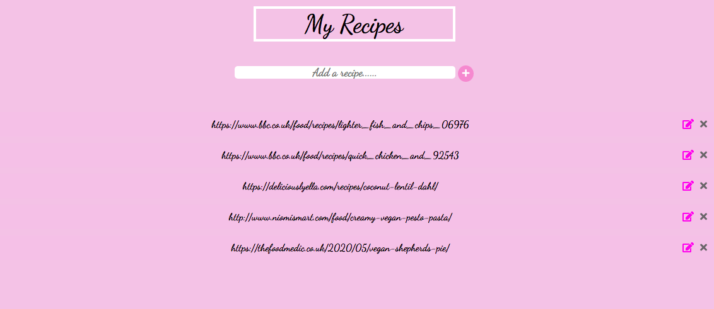
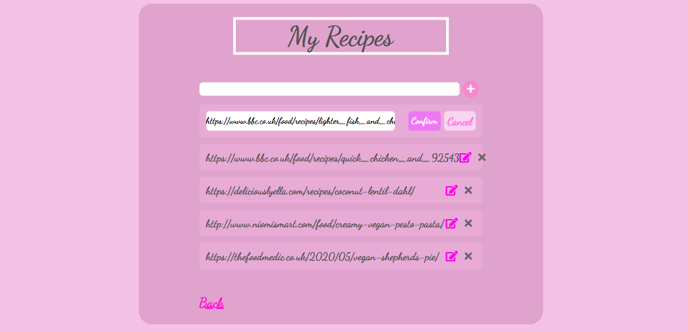

# Recipes

## About Recipes

* Recipes is a simple app built with Node Express and MongoDB. I decided to use the cloud-based MongoDB Atlas with Mongoose as an alternative to MongoDB. Users can add recipes, edit and delete recipes.

## How to run

* Clone the project - git clone https://github.com/emilyjspencer/Recipes.git
* Cd into the repo 
* Type the following command to start the server:
```html
node app.js
```
* Go to: localhost:3000

### Built with:

* Node
* Express
* MongoDB and MongoDB Atlas
* CSS 

### What it looks like:

Homepage:

Editing a recipe:


**Thoughts** - I would like to make the inputs clickable so that the user can click on the link instead of having to manually copy and paste it into the browser.

